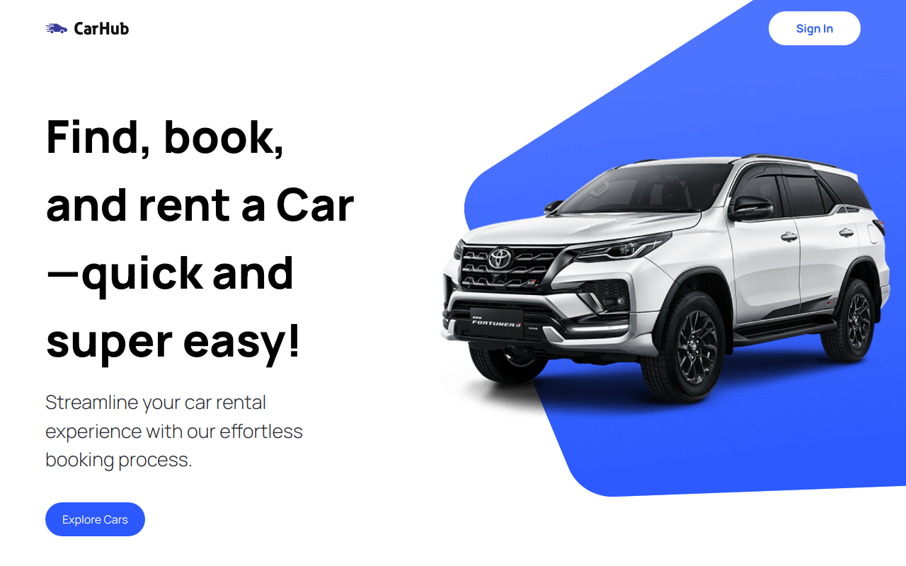

# CarsZone - Car Database



Welcome to Carszone, the Car Rental Platform, a web application built with Next.js, Tailwind CSS, and TypeScript. This platform provides users with the ability to search, and view the details of car from a variety of options available. It aims to simplify the process of finding information about cars.

## Features

- **Car Search**: Users can search for cars based on various criteria such as location, date, and vehicle type.
- **Car Details**: Detailed information about each car, including its specifications, features, and rental rates.
- **Filter**: Filter the Cars by Fuel Type and Year of Manufacturing.

## Technologies Used

- **Next.js**: A React framework for building server-side rendered and statically generated applications.
- **Tailwind CSS**: A utility-first CSS framework for quickly styling the application with minimal custom CSS.
- **TypeScript**: A statically typed superset of JavaScript, providing enhanced developer experience and reducing potential errors.
- **HeadlessUI**: Completely unstyled, fully accessible UI components, designed to integrate beautifully with Tailwind CSS.

## Getting Started

First, run the development server:

```bash
npm run dev
# or
yarn dev
# or
pnpm dev
```

Open [http://localhost:3000](http://localhost:3000) with your browser to see the result.

You can start editing the page by modifying `src/app/page.tsx`. The page auto-updates as you edit the file.

This project uses [`next/font`](https://nextjs.org/docs/basic-features/font-optimization) to automatically optimize and load Inter, a custom Google Font.

## Learn More

To learn more about Next.js, take a look at the following resources:

- [Next.js Documentation](https://nextjs.org/docs) - learn about Next.js features and API.
- [Learn Next.js](https://nextjs.org/learn) - an interactive Next.js tutorial.

You can check out [the Next.js GitHub repository](https://github.com/vercel/next.js/) - your feedback and contributions are welcome!

## Deploy on Vercel

The easiest way to deploy your Next.js app is to use the [Vercel Platform](https://vercel.com/new?utm_medium=default-template&filter=next.js&utm_source=create-next-app&utm_campaign=create-next-app-readme) from the creators of Next.js.

Check out our [Next.js deployment documentation](https://nextjs.org/docs/deployment) for more details.
